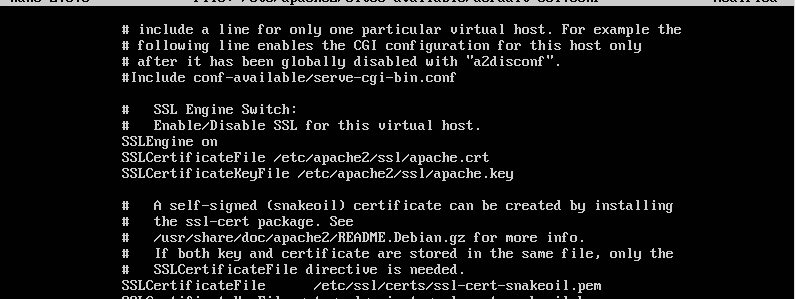
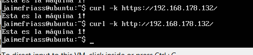
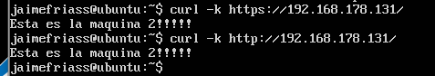
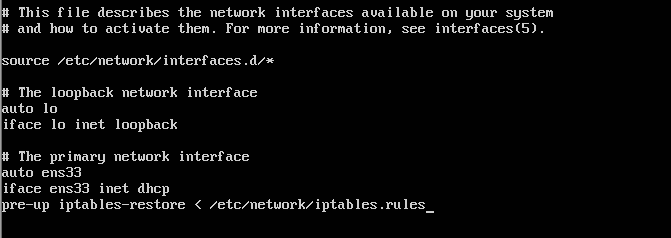

# Práctica 4
## Asegurar la granja web
1. Instalar un certificado SSL autofirmado para configurar el acceso HTTPS a los servidores.

He instalado en las máquinas 1 y 2 el certificado a través del archivo de configuración de Apache: _/etc/apache2/sites-available/default-ssl_

Después desde la máquina 4 externa he comprobado con la llamada *curl -k* que responden correctamente ambas máquinas M1 y M2.

2. Configurar las reglas del cortafuegos con IPTABLES para asegurar el acceso a los servidores web, permitiendo el acceso por los puertos de HTTP y HTTPS.

He configurado las reglas en la máquina 1 por ejemplo tal y como se indica en el guión de prácticas, y para que se mantengan estas en cada reinicio he utilizado la orden **iptables-save** y dentro del archivo _/etc/network/interfaces_ he escrito la linea mostrada abajo cada vez que se abre esta configuración.

